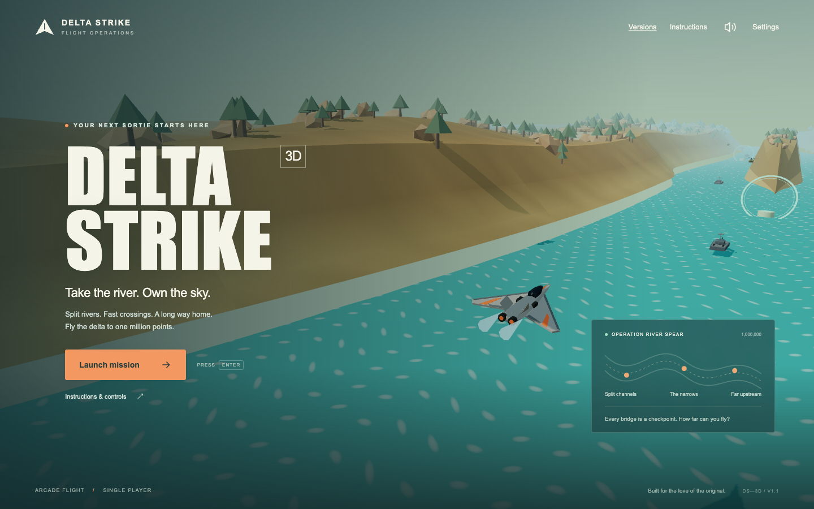

# Delta Strike 3D

**Take the river. Own the sky.**

A fresh third-person arcade flight game inspired by the Delta Strike game in the parent folder. Fly an original delta-wing fighter through a long, progressively harder river expedition. Choose channels around islands, dodge fast crossing jets, destroy bridge control towers, and fly toward the distant finish at **1,000,000 points**.



## Play locally

Requires Node.js 20.19+ or 22.12+ (tested with Node 26).

```sh
cd Delta-Strike-3d
npm install
npm run dev
```

Open the local address printed by Vite, normally `http://127.0.0.1:5173`. The entrance lets you choose Classic 2D or 3D; the direct 3D entry is `/3d.html`. The game needs WebGL 2 and hardware acceleration. All models and audio are local; no accounts, API keys, remote assets, or game servers are required.

## Controls

| Control            | Action                         |
| ------------------ | ------------------------------ |
| Down arrow / W     | Climb (nose up)                |
| Up arrow / S       | Dive (nose down)               |
| A, D / Left, Right | Bank and turn                  |
| Q / E              | Brake / accelerate             |
| Shift              | Boost; recharges when released |
| Space              | Hold to fire cannons           |
| F                  | Launch a homing missile        |
| P / Escape         | Pause / resume                 |
| Enter              | Launch / resume / retry        |
| M                  | Mute / unmute                  |

Flight is assisted: banking changes heading, pitch changes altitude, and releasing the controls gradually levels the aircraft. Heading is limited to the downriver flight envelope. This is an arcade river mission, not a free-roaming flight simulator.

On touch screens, push the stick forward (up) to dive and pull back (down) to climb. Instructions adapt to touch devices. Touch screens have a drag joystick and fire, missile, and boost buttons. On a standard controller, use the left stick to fly, right trigger for cannons, A for missiles, and left trigger for boost. Pause with the on-screen button. Controller input is implemented but has not been tested with physical hardware.

## Your mission

- There is no three-sector limit. New river sections continue until **1,000,000 points**, when the scoreboard becomes **!!!!!!** and the expedition ends. Expect a long score chase rather than a short mission; duration depends on speed, targets destroyed and retries.
- Long raised islands split the river into left and right channels that rejoin downstream. Tight passages, different fuel routes, patrolling boats and helicopters, and fast transverse jets make each section matter.
- Bring targets near the crosshair to acquire a lock. Cannons have a small aim assist cone; missiles home toward locked targets.
- Destroy the marked **bridge control tower** before leaving each sector. Its bridge is a real collision obstacle until destroyed.
- Fly through **green fuel rings below 23 m** to refuel and repair your hull. Shooting a fuel depot destroys it, so choose your firing line carefully.
- You start with **three aircraft** and **four missiles**. Earn an extra aircraft every **10,000 points**, up to nine. Bridges replenish two missiles (up to four). Fuel and hull damage persist across bridges, so refueling remains important.
- After an aircraft loss, retry the current sector. Score and kills return to the checkpoint values; mission flight time continues.
- Bridge checkpoints save automatically in this browser. Use **Continue from bridge…** on the title screen to resume later. A new mission replaces the saved expedition. Failed attempts cannot farm the same extra-life threshold repeatedly.
- Best score, sound, shadows, and camera-motion preferences are saved locally when storage is available.

## Stable core

The simulation has no Three.js, DOM, audio, or storage dependency. It runs at a fixed 60 Hz with bounded catch-up after a stalled frame. Projectiles and crossing aircraft use relative swept 3D collision, world generation is seeded, and retries reset encounter timing. Islands share their shape with collision and spawn rules. Enemy density and fire rates are capped even hundreds of bridges upstream. Input clears on focus loss and the game pauses automatically. Terrain streaming retains 13 nearby chunks and releases discarded GPU resources; models and projectile geometry are shared.

| Location                | Responsibility                                                          |
| ----------------------- | ----------------------------------------------------------------------- |
| `src/core/`             | Flight, combat, mission states, seeded encounters, geometry math, clock |
| `src/render/`           | Chase camera, terrain streaming, GLB models, particles, lighting        |
| `src/platform/`         | Keyboard/touch/controller input and synthesized audio                   |
| `src/main.ts`           | Browser lifecycle, menus, HUD, settings                                 |
| `art/`                  | Editable Blender models, model report, preview and game screenshots     |
| `tools/build_models.py` | Reproducible original model generation/export                           |
| `tests/`                | Simulation, terrain, mission and browser regression checks              |

## Build and verify

```sh
npm test
npm run build
npx playwright install chromium
npm run test:browser
npm run preview
```

The browser checks cover model loading, launch, climb controls, inverted arrow keys, firing, pause/resume, restart, preferences, briefing, mobile layout, persistent checkpoint resume and distant terrain streaming. A simulation test navigates the left forks and refuels through the first three bridges using ordinary control inputs. The million-point finish and corrupt save rejection have separate regression tests. Screenshots are saved in `art/`.

The production build is in `dist/` and uses relative asset URLs so it can be served from a subdirectory. The shared entrance installs a service worker for the selector and classic assets only. A web server is required; opening `index.html` directly from the filesystem will not work.

## Original Blender assets

Five original low-poly models: fighter, enemy jet, helicopter, gunboat, and bridge. Each has an editable `.blend` file and an exported `.glb`. The models use Y-up and forward −Z in the game.

To rebuild the assets on this Mac:

```sh
/Applications/Blender.app/Contents/MacOS/Blender --background --python tools/build_models.py
```

The original 2D game remains in the parent directory. Its game concepts informed this rebuild; its application code and sprites are not dependencies of this project.

License: Apache 2.0, matching the original project.

## Gameplay references for v1.1

- [River Raid gameplay supplied by the user](https://www.youtube.com/watch?v=VfG7oHLLfFo): changing river width, channels, fuel placements, boats and helicopters.
- [Ending discussion supplied by the user](https://www.youtube.com/watch?v=clfkbhibIUY): includes large islands dividing the river and discussion of the distant ending.
- [Original Activision manual, archived at AtariAge](https://atariage.com/manual_html_page.php?SoftwareLabelID=409): the one-million-point exclamation mark scoreboard, extra aircraft at 10,000 points, and increasingly important fuel management.

These inform the mechanics; all 3D art remains original. The arrow keys use aircraft-style pitch (push up to dive, pull down to climb); WASD and touch retain the first version's direction mapping.

## Shared version selector

The root project owns `index.html`, `classic.html` and `selection/`. The Vite build packages these and the original 2D scripts into `dist/` alongside `3d.html`, producing one standalone site. `npm run preview -- --port 4173` serves both editions at the same URL. Deploy the **entire contents of dist**, not only the 3D bundles. Root static serving also works after building, linking to `Delta-Strike-3d/dist/3d.html`.

Selection images are original captures of both games. The selection and classic game are cached offline; 3D retains its existing network loading behavior. An installed classic PWA starts directly at `classic.html`. In either edition, use Versions / Versões to return to the selector.

The production `dist/` folder is committed because the existing GitHub Pages site serves the repository directly. Rebuild and commit it whenever releasing 3D changes.
