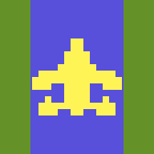

# DELTA STRIKE

Um shooter de rolagem vertical estilo Atari 2600, jogável no browser e no
celular, 100% offline. Homenagem original ao clássico gênero *river shooter*
de 1982: toda a arte, sons e código deste projeto foram criados do zero —
nenhum asset foi extraído de ROMs ou de terceiros.



## Como jogar

Sirva a pasta por HTTP (qualquer servidor estático) e abra no browser:

```bash
python3 -m http.server 8321
# http://localhost:8321
```

> O service worker exige contexto seguro (`localhost` ou HTTPS). Depois do
> primeiro load, o jogo funciona completamente offline e pode ser instalado
> como PWA (portrait, tela cheia).

### Controles — teclado

| Tecla | Ação |
|---|---|
| ← → | dirigir |
| ↑ ↓ | acelerar / frear |
| Espaço | atirar (segure para autofire) |
| Enter | iniciar |
| P | pausar |
| M | mudo |

### Controles — touch (celular)

- **Zona esquerda (60%)**: arraste para dirigir; arraste para cima/baixo para
  acelerar/frear.
- **Zona direita (40%)**: toque para atirar.
- **Cantos superiores** (durante o jogo): esquerdo = mudo, direito = pausa.
- Toque em qualquer lugar para começar.

## Regras

- Destrua navios (30), helicópteros (60), depósitos (80), jatos (100) e
  pontes (500 — checkpoint).
- Reabasteça sobrevoando os depósitos `FUEL` (destruí-los dá pontos, mas
  some o combustível...). Tanque vazio = queda.
- Colidir com margens, ilhas, inimigos ou pontes = perde 1 avião. Você começa
  com 3 de reserva e ganha 1 a cada 10.000 pontos (máx. 9).
- O rio é sempre o mesmo em toda partida (seed fixa, como no clássico) e fica
  mais estreito e mais povoado a cada seção.
- Dizem que aos 1.000.000 de pontos o placar... muda. `!!!!!!`

## Estrutura

```
index.html            página + ordem de carga dos módulos
style.css             centralização, letterbox, pixel-perfect
manifest.webmanifest  PWA
sw.js                 cache-first offline (delta-strike-v1)
js/constants.js       DS.C — todas as constantes + paleta (fonte da verdade)
js/sprites.js         DS.Sprites — pixel-maps e fontes, pré-render + flip
js/audio.js           DS.Audio — SFX 100% sintetizados (Web Audio, estilo TIA)
js/river.js           DS.River — geração determinística do rio por seção
js/entities.js        DS.Entities — player, inimigos, mísseis, colisões
js/game.js            DS.Game — loop 60 Hz, estados, HUD, input, escala
tools/make_icons.py   gerador dos ícones PNG (stdlib apenas)
docs/plan/            especificações completas (design, visual, áudio,
                      arquitetura, contratos de interface)
```

Sem dependências, sem build. `?seed=N` na URL gera um rio alternativo (debug).

## Licença

Apache 2.0 — veja [LICENSE](LICENSE).
