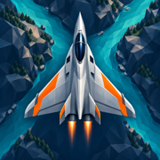
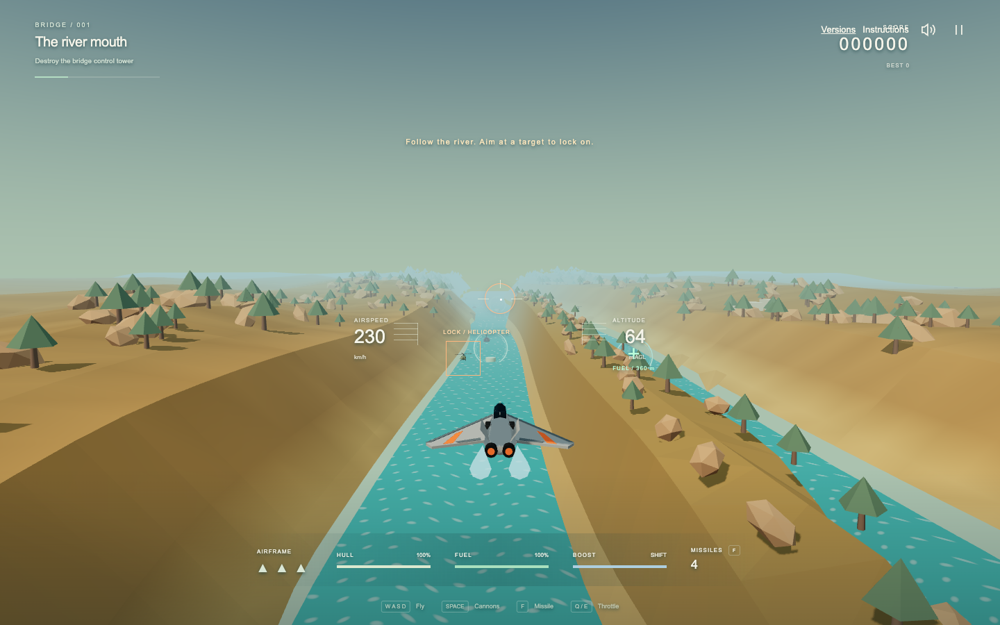

# Delta Strike

**One river. Two ways to fly.**

Delta Strike is an original browser arcade flight game with two editions: a pixel-art river shooter and a third-person 3D expedition. Choose your aircraft, follow the river, and chase the distant **1,000,000-point** finish.



## Play

**[Play Delta Strike](https://eldermoraes.github.io/Delta-Strike/)**

The home page lets you choose **Classic 2D** or **3D**. Both run in the browser on desktop and mobile, with English interfaces. Use **Versions** to return to the selection screen.

| Edition        | Experience                                                                                                                                         |
| -------------- | -------------------------------------------------------------------------------------------------------------------------------------------------- |
| **Classic 2D** | Top-down pixel art, vertical scrolling, fuel management, ships, helicopters, jets and bridge checkpoints.                                          |
| **3D**         | A chase camera behind the aircraft, altitude control, branching rivers, raised islands, narrow canyons, patrolling enemies and fast crossing jets. |

The classic game uses vanilla JavaScript and Canvas 2D. The 3D edition is a separate rebuild using TypeScript, Three.js and Vite, with original Blender models and a fixed-step simulation.

## Controls

### Classic 2D

| Keyboard | Action             |
| -------- | ------------------ |
| ← / →    | Steer              |
| ↑ / ↓    | Accelerate / brake |
| Space    | Hold to fire       |
| Enter    | Start              |
| P        | Pause              |
| M        | Mute / unmute      |

On mobile, drag in the **left zone** to steer; drag up or down to accelerate or brake. Tap the **right zone** to fire. During play, the top-left corner controls sound and the top-right corner pauses. Tap to start.

### 3D

| Keyboard       | Action                                                 |
| -------------- | ------------------------------------------------------ |
| ↑ / S          | Dive: nose down                                        |
| ↓ / W          | Climb: nose up                                         |
| ← / → or A / D | Bank and turn                                          |
| E / Q          | Hold to accelerate / brake; release for cruising speed |
| Shift          | Hold for boost; recharges when released                |
| Space          | Hold to fire cannons                                   |
| F              | Launch a homing missile                                |
| Escape / P     | Pause / resume                                         |
| Enter          | Launch / resume / retry                                |
| M              | Mute / unmute                                          |

On mobile:

- Push the **left stick forward (up) to dive**; pull it **back (down) to climb**. Drag sideways to bank and turn.
- Hold **FIRE** for cannons, tap **MISSILE** to launch, and hold **BOOST** to accelerate.
- Use the joystick and action buttons simultaneously. Holding controls blocks text selection and long-press menus.
- Tap the pause or speaker icon to pause or change sound.

Open **Instructions** from the menu or during flight. It pauses the game and shows touch instructions on touch-oriented devices, or keyboard instructions on desktop.

Standard gamepad input is also implemented for 3D: left stick to fly, RT for cannons, A for missiles and LT for boost. Physical gamepad testing is still pending.

## Gameplay

### Classic 2D

- Destroy ships (30 points), helicopters (60), fuel depots (80), jets (100) and bridges (500).
- Fly over fuel depots to refuel. Shooting one awards points but removes that fuel source.
- Colliding with terrain or enemies, or running out of fuel, costs an aircraft. Start with three in reserve; earn another every 10,000 points, up to nine in reserve.
- The seeded river becomes narrower and more crowded as you progress. Bridges are checkpoints.

### 3D expedition



- The expedition continues beyond the original three-sector prototype, ending at **1,000,000 points** with the **!!!!!!** scoreboard.
- Choose channels around islands, navigate tight passages and watch for high-speed jets crossing the river.
- Enemy fire predicts your movement at launch. Maintaining a straight course can get you hit; change trajectory to dodge the shots.
- Destroy each marked **bridge control tower** before leaving its sector. Avoid bridge decks and supports.
- Fly through **green fuel rings below 23 m** to refuel and repair. Fuel and hull damage carry between bridges.
- Start with three aircraft and four missiles. Earn an extra aircraft every 10,000 points, up to nine. Bridges restore two missiles, up to four.
- Bridge checkpoints save in your browser. Use **Continue from bridge…** to resume. Starting a new expedition replaces the save.
- A retry restores a fresh aircraft at the current sector, with score and kills reset to the checkpoint. Elapsed mission time continues.
- Boost consumes extra fuel. The audio mix emphasizes effects on smaller speakers and compresses overlapping peaks.

Flight is assisted and follows the river: this is an arcade mission with a limited heading range, rather than unrestricted free flight. Saves and preferences are local to each browser; they do not sync between devices.

## Add to your home screen

Open the [game](https://eldermoraes.github.io/Delta-Strike/) in your mobile browser and use **Add to Home Screen** or **Install**. The installed entrance opens the version selector.

The project includes a dedicated fighter-and-river icon, an Apple touch icon, and regular and maskable Android icons. If an older shortcut still shows a letter or the previous artwork, refresh the site and recreate the shortcut.

The **selection screen and Classic 2D** are available offline after their assets have been cached. **3D is not guaranteed to work offline**; it needs its page, bundles and models to load. Online navigation refreshes cached selection/classic pages so releases do not leave players on an old home screen.

## Run locally

### Play the committed build

From the repository root:

```sh
python3 -m http.server 8321
```

Open [localhost:8321](http://localhost:8321/). The repository includes the compiled 3D release, so both editions are playable without installing Node.js. The direct classic entry is `classic.html`.

### Develop or rebuild 3D

Use Node.js 20.19+ or 22.12+.

```sh
cd Delta-Strike-3d
npm ci
npm run dev
```

Open the address printed by Vite, normally [localhost:5173](http://127.0.0.1:5173/). It serves the shared selector and both editions. The direct 3D development entry is `/3d.html`.

```sh
npm run build
npm run preview -- --port 4173
```

The combined production site is generated in `Delta-Strike-3d/dist/`. The 3D renderer requires WebGL 2 and hardware acceleration. Use HTTP or HTTPS rather than opening HTML files directly; service workers require HTTPS or localhost.

## Verify changes

From `Delta-Strike-3d/`:

```sh
npm test
npm run build
npx playwright install chromium
npm run test:browser
npm run format:check
```

Tests cover deterministic simulation, terrain and island geometry, enemy hits and evasive maneuvers, checkpoints, long missions, edition selection, menus, keyboard input, mobile layout, touch pitch and simultaneous held controls. Mobile browser emulation is covered; physical devices still need playtesting.

## Project structure

```text
index.html                  Shared 2D / 3D selection screen
classic.html                Original 2D game entry
selection/                  Selector styling and gameplay images
icons/                      Home-screen and browser icons
manifest.webmanifest        Installation settings
sw.js                       Selection/classic offline cache and online refresh
js/                         Original 2D simulation, sprites, audio and input
style.css                   Classic presentation
Delta-Strike-3d/
  3d.html                   3D game entry
  src/core/                 Fixed-step flight, combat, world and mission state
  src/render/               Terrain, camera, models, effects and lighting
  src/platform/             Input and synthesized audio
  src/main.ts               Menus, HUD, settings and browser lifecycle
  public/models/            Exported GLB models
  art/                      Editable Blender models and screenshots
  tests/                    Simulation and browser regression tests
  tools/                    Blender model generation and rendering
  dist/                     Committed production build
  README.md                 Detailed 3D documentation
docs/plan/                  Original specifications and shared selector design
```

The 3D simulation runs at a fixed 60 Hz, streams nearby terrain, uses swept collision checks and pauses when the page loses focus. See the [3D README](Delta-Strike-3d/README.md) for implementation and model-generation details.

## Publish updates

GitHub Pages serves **`main` at the repository root**. The selector links to the committed `Delta-Strike-3d/dist/3d.html` release.

1. Run the relevant checks and rebuild 3D with `npm run build` whenever changing its source or shared files copied into the bundle.
2. Increment the cache version in `sw.js` when changing cached selection/classic files, then rebuild so `dist/sw.js` matches.
3. Commit source changes and the updated `Delta-Strike-3d/dist/` together, then push to `main`.
4. Wait for GitHub Pages and verify the actual files served at the public URL.

For a different static host, deploy the complete contents of `Delta-Strike-3d/dist/`; it includes the selector, classic game and 3D edition.

## Assets and license

Original pixel art, Blender aircraft and scenery, synthesized sound effects, and generated home-screen artwork. No game ROM assets are used. The older `tools/make_icons.py` script belongs to the original pixel-art icon workflow; it does not reproduce the new home-screen artwork.

Apache 2.0 — see [LICENSE](LICENSE).
